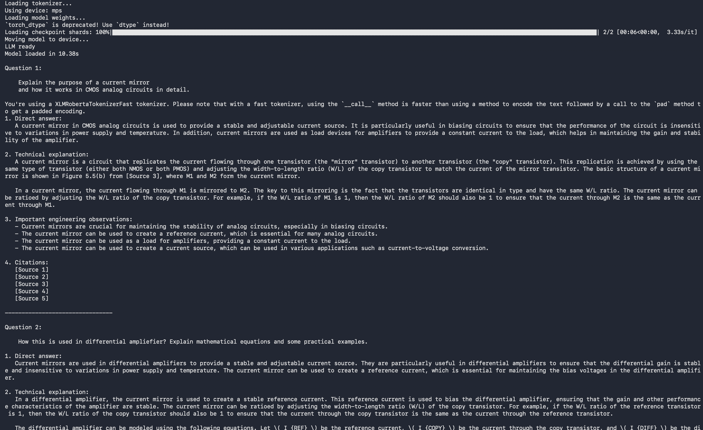

# NeuroVLSI-GPT
<p align="center">
  
</p>


> **An Intelligent Retrieval-Augmented Generation (RAG) Assistant for VLSI Design, Semiconductor Engineering, and Neuromorphic Computing**

NeuroVLSI-GPT is a research-oriented AI assistant designed to provide reliable and context-aware answers for VLSI engineering. Unlike general-purpose language models, NeuroVLSI-GPT combines Retrieval-Augmented Generation (RAG), semantic search, hybrid information retrieval, reranking, and grounded response generation to answer questions using trusted engineering documents rather than relying solely on the language model's internal knowledge.

The project is designed to work completely offline using local language models, ensuring that confidential semiconductor documents, proprietary design notes, research papers, and engineering knowledge remain private.

Instead of training a large language model from scratch, NeuroVLSI-GPT builds a continuously expandable knowledge base by indexing textbooks, research papers, datasheets, lecture notes, documentation, and technical references. This enables accurate and explainable responses while remaining computationally efficient.

The architecture is modular, scalable, and research-friendly, allowing future integration of advanced retrieval techniques, reasoning engines, circuit analysis tools, SPICE simulations, RTL understanding, and hardware-aware AI models.

---

# Project Motivation

Modern Large Language Models possess impressive reasoning abilities but often struggle with highly specialized engineering domains such as VLSI design. They may generate hallucinated answers, omit important technical details, or lack access to proprietary engineering knowledge.

Semiconductor engineers frequently work with information scattered across multiple sources:

- Standard textbooks
- Research papers
- Application notes
- Semiconductor datasheets
- Internal documentation
- Design guidelines
- Technical reports
- Course notes

Finding relevant information across these sources is time-consuming and inefficient.

NeuroVLSI-GPT aims to bridge this gap by creating an engineering-specific AI assistant capable of retrieving relevant technical information before generating an answer.

Instead of asking:

> "What does the model remember?"

the system answers:

> "What does the engineering literature say?"

This retrieval-first architecture significantly improves factual accuracy, transparency, and trustworthiness.

---

# Objectives

The primary objectives of NeuroVLSI-GPT are:

- Build a scalable knowledge base for VLSI engineering
- Support Analog, Digital, Mixed-Signal, RF, FPGA, ASIC, and Neuromorphic domains
- Generate grounded responses using retrieved evidence
- Provide source citations for every answer
- Maintain complete offline execution for data privacy
- Enable future integration with EDA tools
- Serve as a research platform for AI-assisted semiconductor design

---

# Key Features

## Intelligent Document Ingestion

- Automatic PDF discovery
- Document registration
- Duplicate detection
- Incremental indexing
- Change detection
- Metadata extraction

---

## Knowledge Processing

- PDF parsing
- Page extraction
- Recursive text chunking
- Stable chunk identification
- Metadata generation
- Domain tagging

---

## Semantic Understanding

- Sentence Transformer embeddings
- Dense vector representation
- Context-preserving chunk generation
- Similarity search

---

## Hybrid Retrieval

Instead of relying on only one retrieval strategy, NeuroVLSI-GPT combines multiple retrieval techniques:

- Dense Vector Retrieval
- BM25 Keyword Retrieval
- Metadata Filtering
- Retrieval Fusion
- Duplicate Removal
- Source Expansion
- Cross Encoder Reranking

This significantly improves retrieval quality for engineering documents.

---

## Grounded Answer Generation

Every generated answer is supported by retrieved evidence.

The system:

- retrieves relevant documents
- filters useful passages
- constructs context
- generates grounded responses
- injects citations
- maintains conversation history

This minimizes hallucinations while improving answer reliability.

---

## Conversation Memory

The assistant maintains conversational context by storing previous user interactions, enabling follow-up questions such as:

> Explain SRAM.

Followed by:

> How does it differ from DRAM?

without requiring the user to repeat previous information.

---

## Modular Architecture

Every component is implemented independently.

Examples include:

- Document Ingestion
- Chunking
- Embedding Pipeline
- Retrieval Engine
- Reranker
- Context Builder
- Prompt Builder
- Grounding Engine
- Citation Injector
- Local LLM
- Evaluation Framework

This modular design simplifies experimentation and future research.

---

# System Architecture

NeuroVLSI-GPT follows a modular Retrieval-Augmented Generation (RAG) architecture designed specifically for semiconductor engineering. Rather than depending solely on a language model's internal knowledge, the system retrieves relevant technical information from a curated engineering knowledge base before generating an answer.

The architecture is divided into independent components that communicate through well-defined interfaces, allowing individual modules to be improved or replaced without affecting the overall pipeline.

The complete workflow is illustrated below.

```text
                                ┌──────────────────────┐
                                │   PDF Documents      │
                                │ Books • Papers       │
                                │ Notes • Datasheets   │
                                └──────────┬───────────┘
                                           │
                                           ▼
                            ┌──────────────────────────┐
                            │ Document Discovery       │
                            └──────────┬───────────────┘
                                       │
                                       ▼
                            ┌──────────────────────────┐
                            │ PDF Extraction           │
                            └──────────┬───────────────┘
                                       │
                                       ▼
                            ┌──────────────────────────┐
                            │ Recursive Chunking       │
                            └──────────┬───────────────┘
                                       │
                                       ▼
                            ┌──────────────────────────┐
                            │ Metadata Generation      │
                            └──────────┬───────────────┘
                                       │
                                       ▼
                            ┌──────────────────────────┐
                            │ Embedding Generation     │
                            └──────────┬───────────────┘
                                       │
                                       ▼
                            ┌──────────────────────────┐
                            │ Chroma Vector Database   │
                            └──────────┬───────────────┘
                                       │
             ┌─────────────────────────┼──────────────────────────┐
             ▼                         ▼                          ▼
      Vector Retrieval          BM25 Retrieval          Metadata Retrieval
             └───────────────┬───────────────┬────────────────────┘
                             ▼
                   Retrieval Fusion Engine
                             ▼
                    Duplicate Removal
                             ▼
                  Cross Encoder Reranking
                             ▼
                    Context Compression
                             ▼
                     Context Builder
                             ▼
                    Prompt Construction
                             ▼
                     Local Language Model
                             ▼
                  Citation Injection Layer
                             ▼
                   Final Grounded Answer
```

---

# Retrieval Pipeline

The retrieval system is responsible for finding the most relevant engineering knowledge for a user's query.

Instead of relying on a single search technique, NeuroVLSI-GPT combines multiple retrieval strategies to maximize both recall and precision.

The retrieval pipeline consists of the following stages:

```text
User Query
      │
      ▼
Query Analysis
      │
      ▼
Semantic Embedding
      │
      ├────────────► Dense Vector Search
      │
      ├────────────► BM25 Keyword Search
      │
      └────────────► Metadata Search
                      │
                      ▼
             Retrieval Fusion
                      │
                      ▼
            Duplicate Elimination
                      │
                      ▼
           Cross Encoder Reranking
                      │
                      ▼
              Top Ranked Chunks
```

Each retrieval strategy captures different aspects of technical documents.

Dense retrieval captures semantic similarity.

BM25 retrieves exact engineering terminology.

Metadata filtering improves precision using document attributes such as source, domain, and page information.

Cross-encoder reranking finally selects the most relevant passages for answer generation.

---

# Retrieval Components

## Dense Vector Retrieval

Uses sentence embeddings to perform semantic similarity search.

Advantages:

- Understands natural language queries
- Captures conceptual similarity
- Handles paraphrased questions
- Works well for engineering explanations

---

## BM25 Keyword Retrieval

BM25 complements dense retrieval by matching exact engineering terminology.

Advantages:

- Excellent for technical keywords
- Handles abbreviations
- Retrieves equations and definitions
- Strong performance for textbook terminology

---

## Metadata Retrieval

Metadata filtering enables document-aware search.

Examples include:

- Domain filtering
- Source filtering
- Page lookup
- Document lookup

Metadata retrieval becomes increasingly valuable as the knowledge base grows.

---

## Retrieval Fusion

The outputs of multiple retrieval methods are merged into a unified ranked list.

Fusion improves retrieval robustness by combining semantic relevance with lexical matching.

---

## Deduplication

Since multiple retrieval methods may return identical chunks, duplicate entries are removed before reranking.

This improves context diversity while reducing redundant information presented to the language model.

---

## Cross Encoder Reranking

The reranker evaluates every retrieved chunk together with the user query.

Instead of comparing vector similarity alone, the reranker performs deep interaction between the query and document text.

Benefits include:

- Better ranking quality
- Improved engineering relevance
- Higher answer accuracy
- Reduced noisy retrieval

---

# Retrieval Strategy

The retrieval engine intentionally favors higher recall during the initial search.

Pipeline:

1. Retrieve a large candidate set.
2. Merge candidates from multiple retrieval strategies.
3. Remove duplicates.
4. Rerank candidates using a cross encoder.
5. Pass only the highest-quality chunks to the language model.

This strategy minimizes the probability of missing relevant engineering information while maintaining response quality.

---

# RAG Pipeline

The Retrieval-Augmented Generation pipeline combines information retrieval with language generation.

```text
User Question
      │
      ▼
Conversation Memory
      │
      ▼
Query Rewriter
      │
      ▼
Retrieval Pipeline
      │
      ▼
Context Builder
      │
      ▼
Context Compression
      │
      ▼
Answer Grounding
      │
      ▼
Prompt Builder
      │
      ▼
Local Language Model
      │
      ▼
Citation Injection
      │
      ▼
Final Response
```

Every answer generated by the language model is grounded using retrieved engineering evidence rather than relying solely on internal model knowledge.

---

# Grounded Generation

The generated response follows a strict evidence-first approach.

For every user query, the system:

- retrieves relevant technical documents
- extracts supporting passages
- constructs structured context
- generates an answer using only retrieved evidence
- injects citations into the final response

This approach significantly reduces hallucinations while increasing transparency and reliability.

---

# Conversation Flow

NeuroVLSI-GPT maintains conversational context to support follow-up engineering discussions.

```text
User Question
        │
        ▼
Conversation Memory
        │
        ▼
Query Rewriter
        │
        ▼
Retrieval Pipeline
        │
        ▼
Grounded Response
        │
        ▼
Conversation Memory Updated
```

This enables natural conversations where users can ask follow-up questions without repeating previous context.

---

# Project Structure

The repository is organized into independent modules, where each component is responsible for a single stage of the NeuroVLSI-GPT pipeline. This modular design improves maintainability, testing, and future extensibility.

```text
NeuroVLSI-GPT
│
├── configs/                # Project configuration files
│
├── data/
│   ├── raw/                # Original PDFs (books, papers, datasheets, notes)
│   ├── chunks/             # Extracted document chunks
│   ├── embeddings/         # Saved embedding vectors
│   ├── processed/          # Intermediate processed files
│   └── exports/            # Exported datasets
│
├── registry/               # Document registry and synchronization database
│
├── vector_store/           # Chroma vector database
│
├── models/
│   ├── cache/              # Downloaded HuggingFace models
│   └── local_llm/          # Local language model files
│
├── notebooks/              # Research notebooks
│
├── experiments/            # Experimental prototypes
│
├── src/
│   ├── ingestion/
│   ├── chunking/
│   ├── embeddings/
│   ├── metadata/
│   ├── retrieval/
│   ├── rag/
│   ├── llm/
│   ├── vector_store/
│   ├── evaluation/
│   ├── schemas/
│   ├── core/
│   └── utils/
│
├── tests/                  # Unit and integration tests
│
├── ingest.py               # Complete ingestion pipeline
│
├── requirements.txt
│
└── pyproject.toml
```

---

# Source Code Organization

The `src` directory contains the complete implementation of NeuroVLSI-GPT.

Each package has a clearly defined responsibility.

---

## ingestion/

Responsible for transforming raw engineering documents into machine-readable data.

Main responsibilities:

- Document discovery
- PDF parsing
- Registry management
- Incremental synchronization
- Extraction pipeline

This module ensures that only new or modified documents are processed during ingestion.

---

## chunking/

Transforms extracted documents into smaller semantic chunks suitable for retrieval.

Responsibilities include:

- Recursive text splitting
- Chunk generation
- Chunk identifiers
- Chunk storage
- Chunk loading

Proper chunking significantly improves retrieval quality.

---

## embeddings/

Generates vector representations for every document chunk.

Responsibilities:

- Sentence embedding generation
- Batch embedding pipeline
- Embedding persistence

The generated vectors are stored inside the vector database for semantic search.

---

# Data Directory

The `data` directory stores every stage of document processing.

```text
raw PDFs
      │
      ▼
text extraction
      │
      ▼
document chunks
      │
      ▼
metadata generation
      │
      ▼
embedding generation
      │
      ▼
vector database
```

This separation allows every processing stage to be independently inspected, debugged, or regenerated.

---

# Configuration

Project-wide settings are centralized inside the `configs` directory.

Configuration includes:

- Chunk size
- Embedding model
- Retrieval parameters
- Reranker configuration
- Local LLM settings
- Vector database settings

Centralized configuration simplifies experimentation and reproducibility.

---

# Engineering Philosophy

NeuroVLSI-GPT follows a modular engineering-first architecture.

Every component is designed to satisfy three principles:

1. Independence – each module performs a single responsibility.

2. Replaceability – components can be upgraded without affecting the rest of the system.

3. Scalability – the architecture supports growth from a few engineering books to thousands of technical documents without major structural changes.

This design philosophy makes NeuroVLSI-GPT suitable for both academic research and production-scale engineering assistants.

---

# Knowledge Base

NeuroVLSI-GPT is designed to build a continuously growing semiconductor engineering knowledge base.

Unlike traditional chatbots that rely only on pretrained knowledge, NeuroVLSI-GPT retrieves information directly from engineering literature before generating an answer.

The system currently supports knowledge extraction from multiple document types.

## Supported Document Types

- Engineering textbooks
- Research papers
- Lecture notes
- Technical reports
- Semiconductor datasheets
- Application notes
- Design manuals
- Presentation slides

---

# Current Knowledge Domains

The knowledge base is domain-independent and can continuously expand as new documents are added.

Current supported domains include:

### Analog IC Design

- MOSFET Fundamentals
- Current Mirrors
- Differential Amplifiers
- Operational Amplifiers
- Bias Circuits
- Small Signal Analysis
- Frequency Response
- Noise Analysis
- Bandgap References
- Analog Layout Concepts

---

### Digital VLSI

- CMOS Logic
- Combinational Circuits
- Sequential Circuits
- SRAM
- DRAM
- Flip-Flops
- FSM Design
- Timing Analysis
- Clock Distribution
- Digital Design Methodology

---

### Mixed Signal Design

- ADC
- DAC
- PLL
- Data Converters
- Clock Generation
- Signal Integrity

---

### Semiconductor Fundamentals

- PN Junction
- MOS Capacitor
- MOSFET Physics
- Carrier Transport
- Semiconductor Fabrication
- Process Technology
- Scaling
- Reliability

---

### Neuromorphic Computing

- Artificial Neurons
- Synapses
- Crossbar Arrays
- Memristors
- Spiking Neural Networks
- Analog Neural Circuits
- Edge AI Hardware

---

### Future Domains

The architecture is designed to support additional engineering domains without changing the retrieval pipeline.

Planned domains include:

- Physical Design
- RTL Design
- Verification
- DFT
- FPGA Design
- Embedded Systems
- ASIC Flow
- High-Level Synthesis
- RF Circuit Design
- Power Electronics

---

## Local AI

- Offline execution
- Local language model
- No cloud dependency
- Privacy-preserving inference

---

## Engineering Focus

- Source grounded answers
- Engineering explanations
- Page-level citations
- Transparent reasoning pipeline

---

# Design Goals

NeuroVLSI-GPT is designed around five primary goals.

## Accuracy

Answers should be grounded in engineering literature instead of relying on memorized language model knowledge.

---

## Explainability

Every generated answer should reference supporting evidence from the source documents.

---

## Extensibility

New engineering books, papers, and technical documents can be added without changing the architecture.

---

## Scalability

The system is designed to scale from a few books to thousands of engineering documents.

---

# Why NeuroVLSI-GPT?

Traditional language models answer questions using internal pretrained knowledge, which can lead to hallucinations and outdated engineering information.

NeuroVLSI-GPT instead follows a Retrieval-Augmented Generation (RAG) approach.

For every question, the system:

1. Retrieves relevant engineering literature.
2. Reranks the retrieved passages.
3. Builds structured context.
4. Generates an answer using only retrieved evidence.
5. Provides citations for transparency.

This workflow improves reliability, explainability, and trustworthiness, making the system better suited for engineering education, research, and semiconductor design workflows.

---

# Installation

## Prerequisites

Before setting up NeuroVLSI-GPT, ensure the following software is installed.

- Python 3.11+
- Conda or Miniconda
- Git
- pip

The project is designed to run locally and supports CPU execution. GPU acceleration can be added later without changing the architecture.

---

# Clone the Repository

```bash
git clone https://github.com/AryaRaj76438/neurovlsi-assistant

cd neurovlsi
```

---

# Create Environment

```bash
conda create -n neurovlsi python=3.11

conda activate neurovlsi
```

---

# Install Dependencies

```bash
pip install -r requirements.txt
```

---

# Project Setup

Place engineering documents inside:

```text
data/raw/
```

Example:

```text
data/raw/

├── books/
├── papers/
├── datasheets/
├── notes/
└── slides/
```

---

# Build the Knowledge Base

Run the ingestion pipeline.

```bash
python ingest.py
```

The pipeline automatically performs:

- Document discovery
- PDF extraction
- Chunk generation
- Metadata generation
- Embedding creation
- Chroma indexing

No manual preprocessing is required.

---

# Run the Question Answering System

Example:

```python
from src.rag.rag_pipeline import RAGPipeline

pipeline = RAGPipeline()

response = pipeline.ask(
    "Explain how a current mirror works."
)

print(response["answer"])
```

---

# Example Questions

NeuroVLSI-GPT can answer questions across multiple semiconductor domains.

Examples include:

### Analog Design

```
Explain the operation of a current mirror.

Why is cascode current mirror preferred?

How does a differential amplifier reject common mode signals?

What determines op-amp gain?

Explain Miller compensation.
```
---

# Example Response

Question

```text
What is the purpose of a current mirror?
```

Response

```text
A current mirror is an analog circuit used to replicate a reference current into one or more output branches while maintaining high output resistance.

It is widely used for bias generation, active loads, differential amplifiers, and analog signal processing.

The simplest current mirror consists of two matched MOS transistors where one transistor is diode-connected. The gate voltage generated by the reference branch biases the second transistor, allowing it to reproduce approximately the same drain current.

Source:
Design of Analog CMOS Integrated Circuits
Page 153
```

---

# Evaluation

The retrieval system is evaluated independently from the language model.

Current evaluation includes:

- Dense retrieval accuracy
- Hybrid retrieval performance
- BM25 performance
- Reranking quality
- Context relevance
- Retrieval recall
- Retrieval precision

Future evaluation will include:

- Answer faithfulness
- Citation correctness
- Hallucination rate
- Multi-hop reasoning accuracy
- Engineering benchmark datasets

---

# Future Work

Planned improvements include:

## Retrieval

- Multi-hop retrieval
- Graph retrieval
- Query decomposition
- Better metadata generation
- Ontology-aware search

---

# Contributing

Contributions are welcome.

Possible contribution areas include:

- Retrieval algorithms
- Engineering datasets
- Metadata extraction
- Prompt engineering
- Benchmark creation
- Evaluation metrics
- Documentation
- Bug fixes
- Performance optimization

To contribute:

```bash
Fork the repository

Create a feature branch

Commit your changes

Open a Pull Request
```

---

# License

This project is released under the MIT License.

You are free to use, modify, and distribute the project while preserving the license notice.

---

# Acknowledgements

NeuroVLSI-GPT builds upon ideas and research from the open-source AI and semiconductor communities.

Special thanks to the developers and researchers behind:

- PyTorch
- Hugging Face
- Sentence Transformers
- ChromaDB
- LangChain
- Transformers
- Cross Encoder Retrieval
- Retrieval-Augmented Generation (RAG)

The project also draws inspiration from standard semiconductor textbooks, research papers, and publicly available educational resources used for building the engineering knowledge base.

---

# Citation

If you use NeuroVLSI-GPT in your research, please cite:

```bibtex
@software{neurovlsi_gpt,
  title={NeuroVLSI-GPT: A Retrieval-Augmented Language Model for Semiconductor Engineering},
  author={Arya Raj},
  year={2026},
  url={https://github.com/AryaRaj76438/neurovlsi-assistant}
}
```

---

# Author

**Arya Raj: Rajneesh Kumar**

B.Tech Engineering Physics  
Indian Institute of Technology Guwahati

Research Interests

- Analog IC Design
- Neuromorphic Computing
- Semiconductor AI
- Machine Learning
- Hardware-Aware AI

---

# Star the Repository

If you find this project useful for semiconductor engineering, AI research, or educational purposes, consider giving the repository a ⭐.

It helps support future development and makes the project more visible to the community.